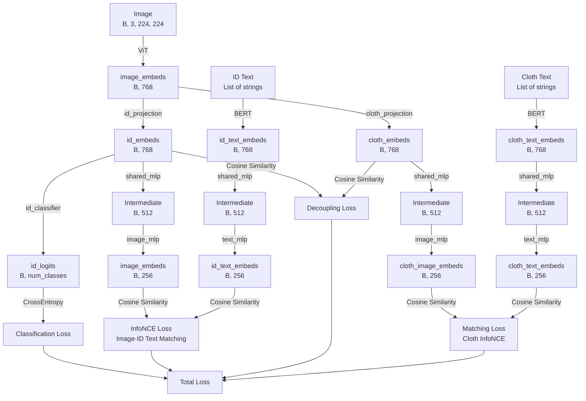

<<<<<<< HEAD
# 模型介绍

---

### **1. 改进方案 3 的理论背景和目标**

#### **1.1 背景**
在文本-图像行人重识别（T2I-ReID）任务中，模型需要从图像和文本描述中提取特征，并进行跨模态匹配。然而，图像特征往往包含多种信息（如身份特征和衣物特征），这些信息可能会相互纠缠，导致模型难以专注于身份相关的信息。例如：
- **身份特征（`id_embeds`）**：与行人的身份（如生物特征：脸部、身形）相关。
- **衣物特征（`cloth_embeds`）**：与行人穿着的衣物（如颜色、款式）相关。

在实际场景中，衣物特征可能会干扰身份识别（例如，同一人穿着不同衣物，或不同人穿着相似衣物）。因此，解纠缠（disentanglement）是一个关键问题，目标是将身份特征和衣物特征分离，同时利用衣物特征辅助跨模态匹配。

#### **1.2 改进方案 3 的目标**
改进方案 3 提出了一种联合优化策略，通过引入两种损失来增强解纠缠效果：
1. **衣物匹配损失（Matching Loss）**：
   - 使用 `cloth_image_embeds`（从图像提取的衣物特征）和 `cloth_text_embeds`（从文本提取的衣物描述特征），计算匹配损失。
   - 鼓励模型学习衣物特征的对齐（图像和文本描述匹配时，相似度高；不匹配时，相似度低）。
2. **身份-衣物解耦损失（Decoupling Loss）**：
   - 使用 `id_embeds` 和 `cloth_embeds`，计算两者的相关性，鼓励两者解耦（即最小化相关性）。
   - 确保 `id_embeds` 专注于身份信息，减少衣物信息的干扰。
3. **联合反馈**：
   - 上述两种损失直接作用于 ViT（视觉Transformer）提取的混合特征，通过梯度反向传播优化 ViT 的特征提取能力，使其更好地分离身份和衣物信息。

#### **1.3 改进的意义**
- **解纠缠**：通过解耦损失，确保 `id_embeds` 和 `cloth_embeds` 分别专注于身份和衣物信息，避免衣物特征干扰身份识别。
- **衣物匹配**：通过匹配损失，利用衣物描述（`cloth_text_embeds`）监督 `cloth_image_embeds` 的提取，增强模型对衣物特征的建模能力。
- **联合优化**：两种损失共同作用于 ViT 的特征提取，使其学习更鲁棒的表示。

---

### **2. 实现步骤和代码改动**

#### **2.1 总体实现步骤**
1. **模型修改**（`pass_transformer_joint.py`）：
   - 从图像提取 `cloth_embeds`，并通过 `shared_mlp` 和 `image_mlp` 降维为 `cloth_image_embeds (B, 256)`。
   - 调整 `forward` 方法，返回 `cloth_image_embeds`，以便后续损失计算。
2. **损失函数定义**（`adv_loss.py`）：
   - 添加 `compute_cloth_matching_loss`，计算 `cloth_image_embeds` 和 `cloth_text_embeds` 的匹配损失。
   - 添加 `compute_decoupling_loss`，计算 `id_embeds` 和 `cloth_embeds` 的解耦损失。
   - 更新 `forward` 方法，计算联合损失。
3. **训练逻辑调整**（`pass_trainer_joint.py`）：
   - 调用模型的 `forward` 方法，获取 `cloth_image_embeds`。
   - 计算联合损失，并记录 `cloth_match` 和 `decouple` 损失。
4. **数据加载支持**（`data_builder_t2i.py`）：
   - 为训练集生成正负样本对（`is_matched=1` 或 `0`），支持衣物匹配损失计算。
5. **配置文件更新**（`config_cuhk_pedes.yaml`）：
   - 添加 `cloth_match` 和 `decouple` 损失的权重。

#### **2.2 代码改动详解**

##### **2.2.1 模型修改（`pass_transformer_joint.py`）**
- **目标**：生成 `cloth_image_embeds (B, 256)`，并返回以供损失计算。
- **改动**：
  - 在 `forward` 方法中，`cloth_embeds` 通过 `shared_mlp` 和 `image_mlp` 降维：
    ```python
    cloth_image_embeds = self.shared_mlp(cloth_embeds)
    cloth_image_embeds = self.image_mlp(cloth_image_embeds)
    cloth_image_embeds = torch.nn.functional.normalize(cloth_image_embeds, dim=-1)
    ```
    - `shared_mlp` 将维度从 `text_width (768)` 降到 `512`，`image_mlp` 进一步降到 `256`，与 `cloth_text_embeds` 的维度一致。
  - 更新返回值，新增 `cloth_image_embeds`：
    ```python
    return (image_embeds, id_text_embeds, fused_embeds, id_logits, id_embeds,
            cloth_embeds, cloth_text_embeds, cloth_image_embeds)
    ```

##### **2.2.2 损失函数定义（`adv_loss.py`）**
- **目标**：定义 `cloth_match` 和 `decouple` 损失，并整合到联合损失中。
- **改动**：
  1. **衣物匹配损失（`compute_cloth_matching_loss`）**：
     - 计算 `cloth_image_embeds` 和 `cloth_text_embeds` 的相似度矩阵，并基于 `is_matched` 标签计算 InfoNCE 损失：
       ```python
       sim = torch.matmul(cloth_image_embeds, cloth_text_embeds.t()) / self.temperature
       labels = torch.arange(batch_size, device=cloth_image_embeds.device)
       loss_i2t = self.ce_loss(sim, labels)
       loss_t2i = self.ce_loss(sim.t(), labels)
       return (loss_i2t + loss_t2i) / 2
       ```
     - 这里的 `labels` 假设正样本是对角线（`is_matched=1` 时，图像和对应的文本匹配），负样本为非对角线。
  2. **解耦损失（`compute_decoupling_loss`）**：
     - 计算 `id_embeds` 和 `cloth_embeds` 的余弦相似度，目标是最小化相关性：
       ```python
       id_embeds = F.normalize(self.id_embed_projector(id_embeds), dim=-1)
       cloth_embeds = F.normalize(self.cloth_embed_projector(cloth_embeds), dim=-1)
       correlation = torch.mean(torch.abs(torch.nn.functional.cosine_similarity(id_embeds, cloth_embeds, dim=-1)))
       return correlation
       ```
     - 使用余弦相似度的绝对值，鼓励 `id_embeds` 和 `cloth_embeds` 接近正交（相关性趋向 0）。
  3. **更新 `forward` 方法**：
     - 新增 `cloth_match` 和 `decouple` 损失的计算，并加入总损失：
       ```python
       losses['cloth_match'] = self.compute_cloth_matching_loss(cloth_image_embeds, cloth_text_embeds, is_matched)
       losses['decouple'] = self.compute_decoupling_loss(id_embeds, cloth_embeds)
       total_loss = sum(self.weights[k] * losses[k] for k in self.weights)
       ```

##### **2.2.3 训练逻辑调整（`pass_trainer_joint.py`）**
- **目标**：整合新损失，并记录日志。
- **改动**：
  - 在 `run` 方法中，解包 `forward` 返回的 `cloth_image_embeds`，并传递给 `combined_loss`：
    ```python
    (image_feats, id_text_feats, fused_feats, id_logits, id_embeds,
     cloth_embeds, cloth_text_embeds, cloth_image_embeds) = self.model(
        image=image, cloth_instruction=cloth_captions, id_instruction=id_captions
    )
    loss_dict = self.combined_loss(
        image_embeds=image_feats,
        id_text_embeds=id_text_feats,
        fused_embeds=fused_feats,
        id_logits=id_logits,
        id_embeds=id_embeds,
        cloth_embeds=cloth_embeds,
        cloth_text_embeds=cloth_text_embeds,
        cloth_image_embeds=cloth_image_embeds,
        pids=pid,
        is_matched=is_matched,
        epoch=epoch
    )
    ```
  - 在 `train` 方法中，更新 `loss_meters` 和日志，新增 `cloth_match` 和 `decouple`：
    ```python
    loss_meters = {
        'total': AverageMeter(),
        'info_nce': AverageMeter(),
        'cls': AverageMeter(),
        'bio': AverageMeter(),
        'cloth': AverageMeter(),
        'cloth_adv': AverageMeter(),
        'cloth_match': AverageMeter(),
        'decouple': AverageMeter()
    }
    logging.info(
        f"Epoch {epoch}/{self.args.epochs}, Batch {i}/{total_batches}, "
        f"Total: {loss_meters['total'].avg:.4f}, "
        f"InfoNCE: {loss_meters['info_nce'].avg:.4f}, "
        f"Cls: {loss_meters['cls'].avg:.4f}, "
        f"Bio: {loss_meters['bio'].avg:.4f}, "
        f"Cloth: {loss_meters['cloth'].avg:.4f}, "
        f"ClothAdv: {loss_meters['cloth_adv'].avg:.4f}, "
        f"ClothMatch: {loss_meters['cloth_match'].avg:.4f}, "
        f"Decouple: {loss_meters['decouple'].avg:.4f}"
    )
    ```

##### **2.2.4 数据加载支持（`data_builder_t2i.py`）**
- **目标**：为训练集生成正负样本对，支持 `cloth_match` 损失计算。
- **改动**：
  - 在 `merge_sub_datasets` 的训练集处理中，为每个图像生成正负样本对：
    ```python
    for pid in train_ids:
        for item in items_by_id[pid]:
            # 正样本：is_matched=1
            pos_cloth_caption = item[1]
            list_lines_all.append((item[0], pos_cloth_caption, item[2], mapped_pid, item[4], 1))
            # 负样本：is_matched=0
            other_pids = [p for p in all_cloth_captions if p[0] != pid]
            if other_pids:
                neg_cloth_caption = random.choice(other_pids)[1]
                list_lines_all.append((item[0], neg_cloth_caption, item[2], mapped_pid, item[4], 0))
    ```
  - 这样，训练数据包含正样本（图像与对应的衣物描述匹配）和负样本（图像与随机选择的衣物描述不匹配），为 `cloth_match` 损失提供了监督信号。

##### **2.2.5 配置文件更新（`config_cuhk_pedes.yaml`）**
- **目标**：添加新损失的权重。
- **改动**：
  - 在 `disentangle.loss_weights` 中添加：
    ```yaml
    cloth_match: 0.5
    decouple: 0.3
    ```
  - 这些权重控制 `cloth_match` 和 `decouple` 损失对总损失的贡献，允许通过配置文件灵活调整。

---

### **3. 改进方案 3 的工作原理**

#### **3.1 特征提取和降维**
- **输入**：
  - 图像通过 ViT（`visual_encoder`）提取特征，得到 `image_embeds (B, 768)`。
  - `image_embeds` 分别通过 `id_projection` 和 `cloth_projection` 生成 `id_embeds (B, 768)` 和 `cloth_embeds (B, 768)`。
- **降维**：
  - `cloth_embeds` 通过 `shared_mlp` 和 `image_mlp` 降维为 `cloth_image_embeds (B, 256)`，与 `cloth_text_embeds (B, 256)` 维度对齐。
  - 降维过程使用了 `shared_mlp`（共享投影层）和 `image_mlp`（图像特定投影层），确保特征空间一致。

#### **3.2 衣物匹配损失**
- **计算**：
  - `cloth_image_embeds` 和 `cloth_text_embeds` 计算相似度矩阵（余弦相似度）。
  - 使用 InfoNCE 损失，基于 `is_matched` 标签，鼓励正样本（`is_matched=1`）的相似度高，负样本（`is_matched=0`）的相似度低。
- **作用**：
  - 监督 `cloth_image_embeds` 的提取，使其更好地捕捉衣物信息，并与文本描述对齐。
  - 通过正负样本对，增强模型对衣物特征的区分能力。

#### **3.3 身份-衣物解耦损失**
- **计算**：
  - `id_embeds` 和 `cloth_embeds` 通过投影头（`id_embed_projector` 和 `cloth_embed_projector`）降维到 `(B, 256)`。
  - 计算两者的余弦相似度，目标是最小化相关性（接近正交）。
- **作用**：
  - 鼓励 `id_embeds` 和 `cloth_embeds` 解耦，确保 `id_embeds` 专注于身份信息，减少衣物信息的干扰。
  - 通过梯度反向传播，优化 ViT 的特征提取，使其更好地分离身份和衣物特征。

#### **3.4 联合反馈**
- 两种损失通过加权求和，共同作用于总损失：
  ```python
  total_loss = (weights['info_nce'] * info_nce + weights['cls'] * cls + weights['bio'] * bio +
                weights['cloth'] * cloth + weights['cloth_adv'] * cloth_adv +
                weights['cloth_match'] * cloth_match + weights['decouple'] * decouple)
  ```
- 梯度通过 ViT 的 `image_embeds` 反向传播，优化其特征提取能力。

---

### **4. 改进效果和潜在影响**

#### **4.1 模型改进**
- **解纠缠效果增强**：
  - `decouple` 损失使 `id_embeds` 和 `cloth_embeds` 更加正交，减少了衣物特征对身份识别的干扰。
  - 这对 T2I-ReID 任务尤其重要，因为衣物变化（如换衣服）不应该影响身份匹配。
- **衣物特征建模更强**：
  - `cloth_match` 损失通过正负样本对，监督 `cloth_image_embeds` 的提取，使其更准确地捕捉衣物信息。
  - 这有助于模型在跨模态匹配中更好地利用衣物描述。

#### **4.2 图表更新**
改进方案 3 的流程可以用以下图表表示（以伪代码形式描述）：
```
[Image] → [ViT] → [image_embeds (B, 768)]
  ├── [id_projection] → [id_embeds (B, 768)] → [shared_mlp → image_mlp] → [image_embeds (B, 256)]
  │      └── [id_classifier] → [id_logits] → [Classification Loss]
  │
  └── [cloth_projection] → [cloth_embeds (B, 768)] → [shared_mlp → image_mlp] → [cloth_image_embeds (B, 256)]

[Cloth Text] → [BERT] → [text_embeds] → [shared_mlp → text_mlp] → [cloth_text_embeds (B, 256)]

[id_embeds] ↔ [cloth_embeds] → [Decoupling Loss]
[cloth_image_embeds] ↔ [cloth_text_embeds] → [Cosine Similarity] → [Matching Loss]
```

- **新增节点**：
  - `cloth_image_embeds (B, 256)`：从 `cloth_embeds` 降维得到。
  - `Matching Loss`：连接 `cloth_image_embeds` 和 `cloth_text_embeds`。
  - `Decoupling Loss`：连接 `id_embeds` 和 `cloth_embeds`。
- **反馈路径**：
  - `Matching Loss` 和 `Decoupling Loss` 的梯度通过 `image_embeds` 反向传播到 ViT，优化其特征提取。

#### **4.3 潜在影响**
- **性能提升**：
  - 身份识别精度（mAP）可能提高，因为 `id_embeds` 更专注于身份信息，减少了衣物干扰。
  - 跨模态匹配能力增强，因为 `cloth_image_embeds` 更好地对齐了衣物描述。
- **训练稳定性**：
  - 引入新损失可能增加训练复杂性，需通过权重（`cloth_match` 和 `decouple`）平衡各损失的贡献。
  - 如果 `decouple` 损失过大，可能导致 `id_embeds` 和 `cloth_embeds` 完全无关，丢失潜在的有用信息。
- **计算开销**：
  - 降维和损失计算略微增加计算量，但由于 `shared_mlp` 和 `image_mlp` 是轻量级 MLP，影响较小。

---

### **5. 总结和建议**

#### **5.1 总结**
改进方案 3 通过引入衣物匹配损失和身份-衣物解耦损失，实现了以下目标：
- 增强了身份和衣物特征的解纠缠效果。
- 提高了模型对衣物特征的建模能力。
- 通过联合损失优化了 ViT 的特征提取，使其更适合 T2I-ReID 任务。

#### **5.2 建议**
1. **超参数调整**：
   - 调整 `disentangle.loss_weights` 中的 `cloth_match` 和 `decouple` 权重，观察对性能的影响。
   - 例如，增大 `cloth_match` 权重（如 0.8），可能进一步提升衣物特征的对齐效果。
2. **正负样本策略**：
   - 当前负样本是随机选择的，可以尝试更难的负样本（如选择相似衣物的描述），增强模型区分能力。
3. **监控解耦效果**：
   - 在训练过程中，记录 `id_embeds` 和 `cloth_embeds` 的相关性（余弦相似度均值），确保解耦效果。
4. **实验验证**：
   - 在 CUHK-PEDES 数据集上测试改进后的模型，比较 mAP 和 Rank-1 指标，验证解纠缠效果。

如果你有更多问题或需要进一步实验支持（例如调整代码、运行实验），请告诉我！

感谢你的提问！针对你提出的三个疑问，我将逐一详细解答，并深入解释改进方案 3 结构中的相关部分，包括 `image_embeds (B, 256)` 的后续处理、余弦相似度的计算及其意义，以及损失计算的原理和作用。让我们一步步分析。

---

### **1. 疑问 1：`image_embeds (B, 256)` 为什么没有后续处理？**

#### **1.1 背景和上下文**
在改进方案 3 的结构中，图像分支通过 ViT 提取特征后，分成两个子分支：
- **身份分支**：`image_embeds (B, 768)` → `id_projection` → `id_embeds (B, 768)` → `shared_mlp` → `Intermediate (B, 512)` → `image_mlp` → `image_embeds (B, 256)`。
- **衣物分支**：`image_embeds (B, 768)` → `cloth_projection` → `cloth_embeds (B, 768)` → `shared_mlp` → `Intermediate (B, 512)` → `image_mlp` → `cloth_image_embeds (B, 256)`。

流程图中，`image_embeds (B, 256)` 是身份分支的末端输出，而 `cloth_image_embeds (B, 256)` 和 `cloth_text_embeds (B, 256)` 被用于计算衣物匹配损失。你提到 `image_embeds (B, 256)` 似乎没有后续处理，这其实是一个误解——它有后续处理，但流程图中没有明确展示。

#### **1.2 解答：`image_embeds (B, 256)` 的后续处理**
- **作用**：`image_embeds (B, 256)` 是从图像中提取的身份特征（identity-focused embeddings），它的主要用途是与身份相关的文本特征（`id_text_embeds (B, 256)`）进行跨模态匹配。
- **后续处理**：
  - 在代码中，`image_embeds (B, 256)` 和 `id_text_embeds (B, 256)` 会被用于计算 **InfoNCE 损失**，以对齐图像和身份文本特征。
  - 具体来说，在 `adv_loss.py` 的 `info_nce_loss` 方法中：
    ```python
    def info_nce_loss(self, image_embeds, text_embeds):
        batch_size = image_embeds.size(0)
        image_embeds = F.normalize(image_embeds, dim=-1)
        text_embeds = F.normalize(text_embeds, dim=-1)
        logits = torch.matmul(image_embeds, text_embeds.t()) / self.temperature
        labels = torch.arange(batch_size, device=image_embeds.device)
        loss_i2t = self.ce_loss(logits, labels)
        loss_t2i = self.ce_loss(logits.t(), labels)
        return (loss_i2t + loss_t2i) / 2
    ```
    - 这里，`image_embeds` 是身份分支的输出，`text_embeds` 是身份文本（`id_instruction`）通过 BERT 编码后降维得到的 `id_text_embeds (B, 256)`。
    - `info_nce_loss` 计算图像-文本对的相似度矩阵（`logits`），并使用 InfoNCE 损失鼓励正样本对（图像和对应的身份文本）相似度高，负样本对（图像和其他身份文本）相似度低。

- **为什么流程图中没有展示？**
  - 流程图主要聚焦于改进方案 3 的新增部分（衣物匹配损失和解耦损失），因此省略了 `image_embeds (B, 256)` 和 `id_text_embeds (B, 256)` 的匹配损失计算。
  - 实际上，`image_embeds (B, 256)` 是整个 T2I-ReID（文本-图像行人重识别）任务的核心输出，用于跨模态检索（matching）。

#### **1.3 更新后的流程图（Mermaid 语法）**
为了更清晰地展示 `image_embeds (B, 256)` 的后续处理，我更新了流程图，添加了身份文本分支和 InfoNCE 损失计算：



- **新增部分**：
  - 添加了身份文本分支：`ID Text` → `BERT` → `id_text_embeds (B, 768)` → `shared_mlp` → `Intermediate (B, 512)` → `text_mlp` → `id_text_embeds (B, 256)`。
  - 添加了 `image_embeds (B, 256)` 和 `id_text_embeds (B, 256)` 的 InfoNCE 损失计算，用于跨模态匹配。

#### **1.4 总结**
- `image_embeds (B, 256)` 并不是没有后续处理，而是用于与 `id_text_embeds (B, 256)` 计算 InfoNCE 损失，以对齐图像和身份文本特征。
- 这是 T2I-ReID 任务的核心目标：通过图像和文本特征的匹配，实现行人重识别。

---

### **2. 疑问 2：`id_embeds` 和 `cloth_embeds` 计算余弦相似度及损失的意义**

#### **2.1 背景**
在改进方案 3 中，`id_embeds (B, 768)` 和 `cloth_embeds (B, 768)` 是从图像特征 `image_embeds (B, 768)` 分离出的两个分支：
- `id_embeds`：表示身份相关的特征（identity-focused embeddings）。
- `cloth_embeds`：表示衣物相关的特征（cloth-focused embeddings）。

为了实现解纠缠（disentanglement），我们希望 `id_embeds` 和 `cloth_embeds` 尽可能独立，即它们的相关性（correlation）应该接近 0。这种独立性可以确保：
- `id_embeds` 专注于身份信息（如生物特征：脸部、身形），不受衣物信息干扰。
- `cloth_embeds` 专注于衣物信息（如颜色、款式），不包含身份信息。

#### **2.2 计算余弦相似度**
- **余弦相似度的定义**：
  - 余弦相似度（Cosine Similarity）用于衡量两个向量之间的相似性，公式为：
    \[
    \text{cosine_similarity}(\mathbf{x}, \mathbf{y}) = \frac{\mathbf{x} \cdot \mathbf{y}}{\|\mathbf{x}\| \|\mathbf{y}\|}
    \]
    - 其中，\(\mathbf{x} \cdot \mathbf{y}\) 是向量点积，\(\|\mathbf{x}\|\) 和 \(\|\mathbf{y}\|\) 是向量的 L2 范数。
    - 余弦相似度的范围为 \([-1, 1]\)：
      - 值为 1：两个向量完全相同（方向一致）。
      - 值为 0：两个向量正交（无相关性）。
      - 值为 -1：两个向量完全相反。
- **代码实现**（`adv_loss.py` 中的 `compute_decoupling_loss`）：
  ```python
  def compute_decoupling_loss(self, id_embeds, cloth_embeds):
      if id_embeds is None or cloth_embeds is None:
          return torch.tensor(0.0, device=next(self.parameters()).device)
      id_embeds = F.normalize(self.id_embed_projector(id_embeds), dim=-1)
      cloth_embeds = F.normalize(self.cloth_embed_projector(cloth_embeds), dim=-1)
      correlation = torch.mean(torch.abs(torch.nn.functional.cosine_similarity(id_embeds, cloth_embeds, dim=-1)))
      return correlation
  ```
  - **步骤 1：投影和归一化**：
    - `id_embeds (B, 768)` 和 `cloth_embeds (B, 768)` 分别通过 `id_embed_projector` 和 `cloth_embed_projector` 降维到 `(B, 256)`。
    - 使用 `F.normalize` 进行 L2 归一化，确保向量的范数为 1（即 \(\|\mathbf{x}\| = 1\)），这样余弦相似度只依赖于向量之间的夹角。
  - **步骤 2：计算余弦相似度**：
    - `torch.nn.functional.cosine_similarity(id_embeds, cloth_embeds, dim=-1)` 计算每对样本（batch 中的每个样本）的余弦相似度，得到形状为 `(B,)` 的张量。
    - 例如，`id_embeds[i]` 和 `cloth_embeds[i]` 是第 \(i\) 个样本的身份和衣物特征，计算它们的余弦相似度。
  - **步骤 3：计算相关性损失**：
    - 使用 `torch.abs` 取绝对值，确保损失值非负（因为我们只关心相关性的大小，不关心方向）。
    - 使用 `torch.mean` 计算 batch 中所有样本的平均余弦相似度，得到一个标量，表示 `id_embeds` 和 `cloth_embeds` 的平均相关性。

#### **2.3 为什么计算余弦相似度？**
- **目标**：我们希望 `id_embeds` 和 `cloth_embeds` 解耦（decouple），即它们的特征空间应该正交（orthogonal），这样身份特征和衣物特征就不会相互干扰。
- **余弦相似度的意义**：
  - 余弦相似度为 0 时，两个向量正交，表示 `id_embeds` 和 `cloth_embeds` 完全无关（理想的解耦状态）。
  - 余弦相似度接近 1 或 -1 时，两个向量高度相关，表示 `id_embeds` 和 `cloth_embeds` 包含大量共享信息（未解耦）。
- **为什么用余弦相似度？**
  - 余弦相似度直接衡量向量之间的方向差异（夹角），不受向量幅度（magnitude）的影响。
  - 在归一化后，余弦相似度等价于点积（`x · y`），计算简单且直观。

#### **2.4 后续计算损失的意义**
- **解耦损失的定义**：
  - 解耦损失（Decoupling Loss）直接取余弦相似度的绝对值均值：
    \[
    \text{Decoupling Loss} = \frac{1}{B} \sum_{i=1}^B \left| \text{cosine_similarity}(\text{id_embeds}_i, \text{cloth_embeds}_i) \right|
    \]
  - 目标是最小化这个损失，使 `id_embeds` 和 `cloth_embeds` 的相关性趋向 0。
- **为什么要最小化相关性？**
  - 在 T2I-ReID 任务中，身份特征（`id_embeds`）应该专注于生物特征（如脸部、身形），而衣物特征（`cloth_embeds`）应该专注于衣物信息（如颜色、款式）。
  - 如果 `id_embeds` 和 `cloth_embeds` 高度相关，说明它们没有成功分离，可能会导致：
    - 身份特征受到衣物变化的干扰（例如，同一人换了衣服后无法识别）。
    - 衣物特征包含身份信息，影响衣物匹配任务的准确性。
  - 通过最小化余弦相似度，模型被鼓励学习正交的特征表示，从而实现解纠缠。
- **梯度作用**：
  - 解耦损失的梯度会通过 `id_embeds` 和 `cloth_embeds` 反向传播到 ViT 的 `image_embeds`，优化 ViT 的特征提取，使其更好地分离身份和衣物信息。

#### **2.5 总结**
- **计算余弦相似度**：衡量 `id_embeds` 和 `cloth_embeds` 的相关性，目标是使它们正交（相似度接近 0）。
- **计算解耦损失**：通过最小化余弦相似度，鼓励模型学习解耦的特征表示，减少身份特征和衣物特征之间的干扰。
- **意义**：解耦损失增强了模型的鲁棒性，使其在衣物变化较大的场景下仍能准确识别身份。

---

### **3. 疑问 3：`cloth_image_embeds` 和 `cloth_text_embeds` 计算余弦相似度及损失的意义**

#### **3.1 背景**
在改进方案 3 中，`cloth_image_embeds (B, 256)` 和 `cloth_text_embeds (B, 256)` 分别是从图像和衣物文本描述提取的特征：
- `cloth_image_embeds`：从图像中提取的衣物特征，经过 ViT 和降维（`shared_mlp` + `image_mlp`）。
- `cloth_text_embeds`：从衣物描述文本中提取的特征，经过 BERT 和降维（`shared_mlp` + `text_mlp`）。

改进方案 3 引入了衣物匹配损失（Matching Loss），目标是让 `cloth_image_embeds` 和 `cloth_text_embeds` 在匹配时（正样本）具有高相似度，在不匹配时（负样本）具有低相似度。

#### **3.2 计算余弦相似度**
- **代码实现**（`adv_loss.py` 中的 `compute_cloth_matching_loss`）：
  ```python
  def compute_cloth_matching_loss(self, cloth_image_embeds, cloth_text_embeds, is_matched):
      if cloth_image_embeds is None or cloth_text_embeds is None or is_matched is None:
          return torch.tensor(0.0, device=next(self.parameters()).device)
      batch_size = cloth_image_embeds.size(0)
      cloth_image_embeds = F.normalize(cloth_image_embeds, dim=-1)
      cloth_text_embeds = F.normalize(cloth_text_embeds, dim=-1)
      sim = torch.matmul(cloth_image_embeds, cloth_text_embeds.t()) / self.temperature
      labels = torch.arange(batch_size, device=cloth_image_embeds.device)
      loss_i2t = self.ce_loss(sim, labels)
      loss_t2i = self.ce_loss(sim.t(), labels)
      return (loss_i2t + loss_t2i) / 2
  ```
  - **步骤 1：归一化**：
    - `cloth_image_embeds (B, 256)` 和 `cloth_text_embeds (B, 256)` 使用 `F.normalize` 进行 L2 归一化，确保向量范数为 1。
  - **步骤 2：计算相似度矩阵**：
    - `torch.matmul(cloth_image_embeds, cloth_text_embeds.t())` 计算相似度矩阵 `sim (B, B)`，其中 `sim[i, j]` 表示第 \(i\) 个图像特征和第 \(j\) 个文本特征的点积（归一化后等价于余弦相似度）。
    - 除以 `temperature`（温度参数，默认为 0.1），缩放相似度值，使分布更尖锐（常见于 InfoNCE 损失）。
  - **步骤 3：生成标签**：
    - `labels = torch.arange(batch_size)` 创建对角线标签，表示正样本对（`is_matched=1` 时，图像和对应的文本匹配）。
    - 例如，`sim[i, i]` 是正样本对的相似度，`sim[i, j]`（\(i \neq j\)）是负样本对的相似度。

#### **3.3 为什么计算余弦相似度？**
- **目标**：衣物匹配损失的目标是让 `cloth_image_embeds` 和 `cloth_text_embeds` 在匹配时（正样本）具有高相似度，在不匹配时（负样本）具有低相似度。
- **余弦相似度的意义**：
  - 余弦相似度衡量 `cloth_image_embeds` 和 `cloth_text_embeds` 之间的方向相似性。
  - 如果图像和文本描述匹配（`is_matched=1`），它们的余弦相似度应该较高（接近 1）。
  - 如果不匹配（`is_matched=0`），余弦相似度应该较低（接近 0 或负值）。
- **为什么用余弦相似度？**
  - 余弦相似度是跨模态匹配任务（图像-文本对齐）的常用指标，因为它只关注向量方向，不受幅度影响。
  - 在归一化后，余弦相似度等价于点积，计算效率高。

#### **3.4 后续计算损失的意义**
- **衣物匹配损失的定义**：
  - 衣物匹配损失使用 InfoNCE 损失（也称为对比损失，Contrastive Loss）：
    \[
    \text{Loss}_{\text{i2t}} = -\frac{1}{B} \sum_{i=1}^B \log \frac{\exp(\text{sim}[i, i] / \tau)}{\sum_{j=1}^B \exp(\text{sim}[i, j] / \tau)}
    \]
    \[
    \text{Loss}_{\text{t2i}} = -\frac{1}{B} \sum_{j=1}^B \log \frac{\exp(\text{sim}[j, j] / \tau)}{\sum_{i=1}^B \exp(\text{sim}[i, j] / \tau)}
    \]
    \[
    \text{Cloth Matching Loss} = \frac{\text{Loss}_{\text{i2t}} + \text{Loss}_{\text{t2i}}}{2}
    \]
    - 其中，\(\tau\) 是温度参数（`self.temperature`），`sim[i, j]` 是相似度矩阵的元素。
  - **代码对应**：
    - `loss_i2t`：图像到文本的 InfoNCE 损失，鼓励第 \(i\) 个图像与第 \(i\) 个文本（正样本）匹配。
    - `loss_t2i`：文本到图像的 InfoNCE 损失，鼓励第 \(j\) 个文本与第 \(j\) 个图像（正样本）匹配。
    - 最终损失取两者平均。
- **为什么用 InfoNCE 损失？**
  - InfoNCE 损失是一种对比学习（contrastive learning）方法，广泛用于跨模态任务（如图像-文本匹配）。
  - 它通过最大化正样本对的相似度、最小化负样本对的相似度，学习对齐的特征表示。
  - 在这里，`is_matched` 标签决定了哪些是正样本（`is_matched=1`）和负样本（`is_matched=0`），InfoNCE 损失利用这些标签进行监督。
- **梯度作用**：
  - 衣物匹配损失的梯度会通过 `cloth_image_embeds` 反向传播到 ViT，通过 `cloth_text_embeds` 反向传播到 BERT，优化两者的特征提取，使其更好地对齐衣物信息。

#### **3.5 意义**
- **增强衣物特征建模**：
  - 通过衣物匹配损失，模型学习到 `cloth_image_embeds` 和 `cloth_text_embeds` 的对齐关系，使其更好地捕捉衣物信息。
  - 例如，图像中的“红色夹克”应该与文本描述“a red jacket”匹配，而与“a blue shirt”不匹配。
- **辅助身份识别**：
  - 衣物特征的准确建模可以辅助身份识别任务。例如，在跨模态检索中，衣物描述可以作为额外的线索，帮助模型找到目标行人。
- **正负样本的作用**：
  - 数据加载中生成的正负样本对（`data_builder_t2i.py`）为衣物匹配损失提供了监督信号，使模型能够区分匹配和不匹配的衣物描述。

#### **3.6 总结**
- **计算余弦相似度**：衡量 `cloth_image_embeds` 和 `cloth_text_embeds` 的相似性，用于跨模态匹配。
- **计算衣物匹配损失**：通过 InfoNCE 损失，鼓励匹配的图像-文本对具有高相似度，不匹配的对具有低相似度，从而对齐衣物特征。
- **意义**：增强模型对衣物特征的建模能力，提升跨模态匹配的准确性。

---

### **4. 总结和对比**

#### **4.1 两种余弦相似度和损失的对比**
| **方面**           | **解耦损失（`id_embeds` 和 `cloth_embeds`）**   | **衣物匹配损失（`cloth_image_embeds` 和 `cloth_text_embeds`）** |
| ------------------ | ----------------------------------------------- | ------------------------------------------------------------ |
| **输入**           | `id_embeds (B, 768)` 和 `cloth_embeds (B, 768)` | `cloth_image_embeds (B, 256)` 和 `cloth_text_embeds (B, 256)` |
| **目标**           | 最小化相关性（使特征正交）                      | 最大化正样本相似度，最小化负样本相似度                       |
| **余弦相似度计算** | 逐样本计算余弦相似度，取绝对值后平均            | 计算相似度矩阵（`B × B`），用于 InfoNCE 损失                 |
| **损失类型**       | 直接使用余弦相似度均值作为损失                  | InfoNCE 损失（对比损失）                                     |
| **作用**           | 解耦身份和衣物特征，减少干扰                    | 对齐图像和文本的衣物特征，提升匹配能力                       |

#### **4.2 为什么需要这两种损失？**
- **解耦损失**：
  - 解决特征纠缠问题，确保 `id_embeds` 和 `cloth_embeds` 分别专注于身份和衣物信息。
  - 提高模型的鲁棒性，使其在衣物变化较大的场景下仍能准确识别身份。
- **衣物匹配损失**：
  - 利用衣物描述（`cloth_text_embeds`）监督 `cloth_image_embeds` 的提取，增强衣物特征的建模能力。
  - 提供额外的监督信号，辅助跨模态检索任务。

#### **4.3 梯度反馈**
- 两种损失的梯度都会反向传播到 ViT 和 BERT，优化它们的特征提取：
  - 解耦损失通过 `id_embeds` 和 `cloth_embeds` 影响 ViT，使其学习分离的特征。
  - 衣物匹配损失通过 `cloth_image_embeds` 和 `cloth_text_embeds` 分别影响 ViT 和 BERT，使它们学习对齐的衣物特征。

---

### **5. 进一步建议**
1. **可视化相关性**：
   - 在训练过程中，记录 `id_embeds` 和 `cloth_embeds` 的平均余弦相似度，观察解耦效果。
   - 如果相似度没有下降，可以增大 `decouple` 损失的权重（`disentangle.loss_weights.decouple`）。
2. **负样本策略**：
   - 当前负样本是随机选择的，可以尝试更难的负样本（如选择相似衣物的描述），增强衣物匹配的区分能力。
3. **超参数调整**：
   - 调整 `temperature` 参数（`adv_loss.py` 中的 `self.temperature`），观察对 InfoNCE 损失的影响。
   - 调整 `cloth_match` 和 `decouple` 损失的权重，平衡它们对总损失的贡献。

如果你有更多疑问或需要进一步分析，请告诉我！
=======
# 模型结构

### 1. 模型概述
`T2IReIDModel` 是一个多模态行人重识别模型，目标是通过图像和文本描述（例如身份描述和衣物描述）来识别特定行人。它结合了以下核心组件：
- **视觉编码器**：基于 Vision Transformer (ViT)，用于提取图像特征。
- **文本编码器**：基于 BERT，提取文本描述的语义特征。
- **特征解纠缠**：通过投影头和梯度反转层（GRL）分离身份（ID）相关特征和衣物相关特征。
- **特征融合**：通过可选的融合模块将图像和文本特征结合，生成统一的表示。
- **分类器**：用于身份分类（基于身份特征）。

该模型特别适用于需要处理多模态输入（图像+文本）的场景，例如在行人重识别任务中，结合图像和文本描述来提高识别精度。

---

### 2. 代码结构解析

#### 2.1 导入和初始化
```python
import logging
from pathlib import Path
import torch
import torch.nn as nn
from transformers import BertModel, BertTokenizer, ViTModel
from ..utils.serialization import copy_state_dict
from .fusion import get_fusion_module
logging.getLogger("transformers").setLevel(logging.ERROR)
```
- **依赖**：使用 PyTorch 作为深度学习框架，`transformers` 库提供预训练的 BERT 和 ViT 模型，`pathlib` 用于处理文件路径，`logging` 用于记录日志。
- **日志设置**：将 `transformers` 的日志级别设为 `ERROR`，减少不必要的输出。
- **自定义模块**：`copy_state_dict`（用于加载模型参数）和 `get_fusion_module`（用于获取特征融合模块）是从其他模块导入的。

#### 2.2 梯度反转层（GradientReversalLayer）
```python
class GradientReversalLayer(torch.autograd.Function):
    @staticmethod
    def forward(ctx, x, alpha):
        ctx.alpha = alpha
        return x.view_as(x)

    @staticmethod
    def backward(ctx, grad_output):
        return -ctx.alpha * grad_output, None
```
- **作用**：梯度反转层（GRL）是一种对抗学习技术，常用于域适配或特征解纠缠。在前向传播中，它直接返回输入（不改变数据）；在反向传播中，它将梯度反转并按 `alpha` 缩放。
- **用途**：在该模型中，GRL 用于衣物特征的解纠缠。通过反转梯度，模型学习到的衣物特征尽量与身份无关，从而分离身份和衣物信息。
- **参数**：
  - `x`：输入张量（例如衣物特征）。
  - `alpha`：梯度缩放系数，控制反转梯度的强度。

#### 2.3 模型类 `T2IReIDModel`
```python
class T2IReIDModel(nn.Module):
    def __init__(self, net_config):
        super().__init__()
        self.net_config = net_config
        self.alpha = net_config.get('grl_alpha', 1.0)  # GRL 缩放系数
```
- **继承**：模型继承自 `nn.Module`，是 PyTorch 的标准神经网络基类。
- **配置**：`net_config` 是一个字典，包含模型的超参数，例如预训练模型路径、融合模块配置、类别数等。
- **GRL 参数**：`self.alpha` 是梯度反转层的缩放系数，默认值为 1.0，可通过 `net_config` 配置。

---

#### 2.4 初始化编码器和模块
```python
bert_base_path = Path(net_config.get('bert_base_path', 'pretrained/bert-base-uncased'))
vit_base_path = Path(net_config.get('vit_pretrained', 'pretrained/vit-base-patch16-224'))
fusion_config = net_config.get('fusion', {})
num_classes = net_config.get('num_classes', 8000)

if not bert_base_path.exists() or not vit_base_path.exists():
    raise FileNotFoundError(f"Model path not found: {bert_base_path} or {vit_base_path}")

self.tokenizer = BertTokenizer.from_pretrained(str(bert_base_path))
self.text_encoder = BertModel.from_pretrained(str(bert_base_path))
self.text_width = self.text_encoder.config.hidden_size
self.visual_encoder = ViTModel.from_pretrained(str(vit_base_path))
```
- **预训练模型路径**：
  - BERT 模型路径：默认使用 `bert-base-uncased`。
  - ViT 模型路径：默认使用 `vit-base-patch16-224`。
  - 如果路径不存在，抛出 `FileNotFoundError`。
- **文本编码器**：
  - `BertTokenizer`：用于将文本分词并转换为 BERT 模型的输入格式。
  - `BertModel`：预训练的 BERT 模型，用于提取文本特征。
  - `self.text_width`：BERT 的隐藏层维度（通常为 768）。
- **视觉编码器**：
  - `ViTModel`：预训练的 Vision Transformer 模型，用于提取图像特征。
- **类别数**：`num_classes` 表示身份分类的类别数，默认 8000。

#### 2.5 解纠缠模块
```python
self.id_projection = nn.Linear(self.text_width, self.text_width)
self.id_classifier = nn.Linear(self.text_width, num_classes)
self.cloth_projection = nn.Linear(self.text_width, self.text_width)
```
- **身份投影头**：`id_projection` 是一个线性层，将图像或文本特征投影到身份相关的子空间。
- **身份分类器**：`id_classifier` 将身份特征映射到类别空间，用于身份分类任务。
- **衣物投影头**：`cloth_projection` 将特征投影到衣物相关的子空间，结合 GRL 用于对抗学习，分离衣物特征。

#### 2.6 共享和模态特定 MLP
```python
self.shared_mlp = nn.Linear(self.text_width, 512)
self.image_mlp = nn.Sequential(
    nn.BatchNorm1d(512), nn.ReLU(), nn.Dropout(0.2),
    nn.Linear(512, 256), nn.BatchNorm1d(256), nn.ReLU(), nn.Dropout(0.2),
    nn.Linear(256, 256)
)
self.text_mlp = nn.Sequential(
    nn.BatchNorm1d(512), nn.ReLU(), nn.Dropout(0.2),
    nn.Linear(512, 256), nn.BatchNorm1d(256), nn.ReLU(), nn.Dropout(0.2),
    nn.Linear(256, 256)
)
```
- **共享 MLP**：`shared_mlp` 是一个线性层，将不同模态（图像和文本）的特征投影到统一的 512 维空间。
- **模态特定 MLP**：
  - `image_mlp` 和 `text_mlp` 分别是图像和文本的专用多层感知机（MLP）。
  - 结构：BatchNorm → ReLU → Dropout → Linear → BatchNorm → ReLU → Dropout → Linear。
  - 作用：将 512 维特征进一步映射到 256 维，并通过归一化、激活和 dropout 提高模型的泛化能力。
  - 输出：256 维的归一化特征，用于后续匹配或融合。

#### 2.7 融合模块
```python
self.fusion = get_fusion_module(fusion_config) if fusion_config else None
self.feat_dim = fusion_config.get("output_dim", 256) if fusion_config else 256
self.scale = nn.Parameter(torch.ones(1), requires_grad=True)
logging.info(f"Initialized model with scale: {self.scale.item():.4f}, fusion: {fusion_config.get('type', 'None')}")
```
- **融合模块**：`get_fusion_module` 根据 `fusion_config` 返回一个特征融合模块（例如加法、乘法或其他复杂融合方式）。如果没有配置融合模块，则为 `None`。
- **输出维度**：`feat_dim` 表示融合特征的维度，默认 256。
- **缩放参数**：`scale` 是一个可学习的参数，用于调整融合特征的幅度。

---

#### 2.8 更新 GRL 的 alpha 参数
```python
def update_alpha(self, epoch):
    self.alpha = min(1.0, 0.1 + epoch * 0.02)
    logging.info(f"Updated GRL alpha to {self.alpha:.4f} at epoch {epoch}")
```
- **作用**：动态调整 GRL 的缩放系数 `alpha`，使其随训练轮次（epoch）递增。
- **公式**：`alpha = min(1.0, 0.1 + epoch * 0.02)`，初始值为 0.1，每轮增加 0.02，最大值为 1.0。
- **意义**：在训练早期，较小的 `alpha` 减弱对抗学习的强度，防止模型过早收敛到次优解；随着训练进行，`alpha` 逐渐增大，增强对抗效果。

---

#### 2.9 图像编码
```python
def encode_image(self, image):
    if image is None:
        return None
    device = next(self.parameters()).device
    if image.dim() == 5:
        image = image.squeeze(-1)
    image = image.to(device)
    image_outputs = self.visual_encoder(image)
    image_embeds = image_outputs.last_hidden_state[:, 0, :]
    id_embeds = torch.nn.functional.relu(self.id_projection(image_embeds))
    image_embeds = self.shared_mlp(id_embeds)
    image_embeds = self.image_mlp(image_embeds)
    image_embeds = torch.nn.functional.normalize(image_embeds, dim=-1)
    return image_embeds
```
- **输入处理**：
  - 如果输入图像为 `None`，返回 `None`。
  - 将图像移动到模型所在的设备（CPU 或 GPU）。
  - 如果图像张量是 5 维（例如包含额外维度），通过 `squeeze` 去除多余维度。
- **编码过程**：
  1. 使用 ViT 模型（`visual_encoder`）提取图像特征，获取 `[CLS]` 标记的特征（`last_hidden_state[:, 0, :]`）。
  2. 通过 `id_projection` 投影到身份子空间，并应用 ReLU 激活。
  3. 通过 `shared_mlp` 和 `image_mlp` 进一步映射到 256 维空间。
  4. 对特征进行 L2 归一化（`normalize`），确保特征在单位球面上。
- **输出**：256 维的归一化图像特征。

---

#### 2.10 文本编码
```python
def encode_text(self, instruction):
    if instruction is None:
        return None
    device = next(self.parameters()).device
    tokenized = self.tokenizer(
        instruction, padding='max_length', max_length=100,
        truncation=True, return_tensors="pt"
    ).to(device)
    text_outputs = self.text_encoder(**tokenized)
    text_embeds = text_outputs.last_hidden_state[:, 0, :]
    text_embeds = self.shared_mlp(text_embeds)
    text_embeds = self.text_mlp(text_embeds)
    text_embeds = torch.nn.functional.normalize(text_embeds, dim=-1)
    return text_embeds
```
- **输入处理**：
  - 如果输入文本为 `None`，返回 `None`。
  - 使用 `BertTokenizer` 将文本分词，填充到最大长度 100，截断超长部分，并转换为 PyTorch 张量。
- **编码过程**：
  1. 使用 BERT 模型（`text_encoder`）提取文本特征，获取 `[CLS]` 标记的特征。
  2. 通过 `shared_mlp` 和 `text_mlp` 映射到 256 维空间。
  3. 对特征进行 L2 归一化。
- **输出**：256 维的归一化文本特征。

---

#### 2.11 前向传播
```python
def forward(self, image=None, cloth_instruction=None, id_instruction=None):
    device = next(self.parameters()).device
    id_logits, id_embeds, cloth_embeds = None, None, None
```
- **输入**：
  - `image`：输入图像（可选）。
  - `cloth_instruction`：衣物描述文本（可选）。
  - `id_instruction`：身份描述文本（可选）。
- **初始化**：将输出变量初始化为 `None`。

##### 2.11.1 图像编码与解纠缠
```python
if image is not None:
    if image.dim() == 5:
        image = image.squeeze(-1)
    image = image.to(device)
    image_outputs = self.visual_encoder(image)
    image_embeds = image_outputs.last_hidden_state[:, 0, :]

    id_embeds = torch.nn.functional.relu(self.id_projection(image_embeds))
    id_logits = self.id_classifier(id_embeds)

    cloth_embeds = self.cloth_projection(image_embeds)
    cloth_embeds = GradientReversalLayer.apply(cloth_embeds, self.alpha)
    cloth_embeds = torch.nn.functional.relu(cloth_embeds)

    image_embeds = self.shared_mlp(id_embeds)
    image_embeds = self.image_mlp(image_embeds)
    image_embeds = torch.nn.functional.normalize(image_embeds, dim=-1)

    cloth_image_embeds = self.shared_mlp(cloth_embeds)
    cloth_image_embeds = self.image_mlp(cloth_image_embeds)
    cloth_image_embeds = torch.nn.functional.normalize(cloth_image_embeds, dim=-1)
else:
    image_embeds = None
    cloth_image_embeds = None
```
- **图像编码**：
  - 使用 ViT 提取图像特征，获取 `[CLS]` 标记的特征。
- **身份解纠缠**：
  - 通过 `id_projection` 投影到身份子空间，生成 `id_embeds`。
  - 使用 `id_classifier` 计算身份分类的 logits（`id_logits`）。
- **衣物解纠缠**：
  - 通过 `cloth_projection` 投影到衣物子空间。
  - 应用 GRL（`GradientReversalLayer`）反转梯度，生成 `cloth_embeds`。
  - 对 `cloth_embeds` 应用 ReLU 激活。
- **特征投影**：
  - 身份特征（`id_embeds`）通过 `shared_mlp` 和 `image_mlp` 映射到 256 维，生成归一化的 `image_embeds`。
  - 衣物特征（`cloth_embeds`）通过相同的 MLP 路径映射到 256 维，生成归一化的 `cloth_image_embeds`。

##### 2.11.2 文本编码
```python
cloth_text_embeds = self.encode_text(cloth_instruction)
id_text_embeds = self.encode_text(id_instruction)
```
- 调用 `encode_text` 方法，分别对衣物描述和身份描述进行编码，生成归一化的 256 维特征。

##### 2.11.3 特征融合
```python
fused_embeds = None
if self.fusion and image_embeds is not None and id_text_embeds is not None:
    fused_embeds = self.fusion(image_embeds, id_text_embeds)
    fused_embeds = self.scale * torch.nn.functional.normalize(fused_embeds, dim=-1)
```
- 如果存在融合模块（`self.fusion`）且图像和身份文本特征都可用，则调用融合模块融合特征。
- 融合后的特征通过 `scale` 参数缩放并归一化。

##### 2.11.4 输出
```python
return (image_embeds, id_text_embeds, fused_embeds, id_logits, id_embeds,
        cloth_embeds, cloth_text_embeds, cloth_image_embeds)
```
- **输出**：
  - `image_embeds`：归一化的图像身份特征（256 维）。
  - `id_text_embeds`：归一化的身份文本特征（256 维）。
  - `fused_embeds`：融合特征（如果启用融合模块）。
  - `id_logits`：身份分类的 logits。
  - `id_embeds`：身份投影后的特征（未经过 MLP）。
  - `cloth_embeds`：衣物投影后的特征（经过 GRL）。
  - `cloth_text_embeds`：归一化的衣物文本特征（256 维）。
  - `cloth_image_embeds`：归一化的图像衣物特征（256 维）。

---

#### 2.12 加载预训练参数
```python
def load_param(self, trained_path):
    trained_path = Path(trained_path)
    checkpoint = torch.load(trained_path, map_location='cpu', weights_only=True)
    state_dict = checkpoint.get('state_dict', checkpoint.get('model', checkpoint))
    self = copy_state_dict(state_dict, self)
    logging.info(f"Loaded checkpoint from {trained_path}, scale: {self.scale.item():.4f}")
    return self
```
- **作用**：从指定路径加载预训练模型参数。
- **过程**：
  1. 使用 `torch.load` 加载检查点文件，映射到 CPU。
  2. 从检查点中提取 `state_dict`（模型参数）。
  3. 使用 `copy_state_dict` 将参数加载到当前模型。
- **日志**：记录加载的检查点路径和 `scale` 参数的值。

---

### 3. 模型设计亮点
1. **多模态融合**：
   - 通过 ViT 和 BERT 提取高质量的图像和文本特征。
   - 可选的融合模块允许灵活地结合图像和文本特征，适应不同任务需求。
2. **特征解纠缠**：
   - 使用投影头（`id_projection` 和 `cloth_projection`）将特征分离为身份和衣物子空间。
   - GRL 通过对抗学习确保衣物特征与身份无关，增强模型的鲁棒性。
3. **动态 GRL**：
   - `update_alpha` 方法动态调整 GRL 的强度，平衡训练早期的稳定性和后期的对抗效果。
4. **归一化特征**：
   - 所有输出特征（图像、文本、融合）都经过 L2 归一化，便于度量学习（例如余弦相似度）。
5. **模块化设计**：
   - 融合模块和 MLP 结构可通过配置灵活调整。
   - 预训练模型（BERT 和 ViT）提供强大的初始化，减少训练成本。

------

### 融合模块

好的！以下是对你提供的 `AttentionGatedFusion` 融合模块代码的详细解析，结合你的问题（输入图像尺寸为 224×224，解释生成的权重向量及图像和文本特征的维度）。我会逐部分分析代码的结构、功能、设计意图，并明确权重向量的生成过程和特征维度。

---

### 1. 融合模块概述
`AttentionGatedFusion` 是一个基于跨模态注意力和门控机制的融合模块，旨在整合图像和文本特征，生成统一的特征表示。它结合了多头注意力机制（Multihead Attention）和门控机制（Gating Mechanism），通过以下步骤实现特征融合：
1. **跨模态注意力**：通过注意力机制让图像特征和文本特征相互交互，增强彼此的语义表示。
2. **门控机制**：动态计算图像和文本特征的权重，决定融合时各模态的贡献。
3. **特征融合**：根据门控权重加权融合特征，并通过全连接层和归一化生成最终输出。

该模块适用于多模态任务（例如行人重识别、跨模态检索等），特别适合需要动态平衡图像和文本信息贡献的场景。

---

### 2. 代码结构解析

#### 2.1 导入和类定义
```python
import torch
import torch.nn as nn

class AttentionGatedFusion(nn.Module):
    """结合跨模态注意力和门控机制的融合模块，用于整合图像和文本特征。"""
```
- **依赖**：使用 PyTorch 的 `torch` 和 `nn` 模块。
- **类定义**：`AttentionGatedFusion` 继承自 `nn.Module`，是 PyTorch 的标准神经网络模块。

#### 2.2 初始化方法
```python
def __init__(self, dim, num_heads=4, output_dim=256, dropout=0.1):
    super().__init__()
    self.image_attn = nn.MultiheadAttention(embed_dim=dim, num_heads=num_heads, dropout=dropout)
    self.text_attn = nn.MultiheadAttention(embed_dim=dim, num_heads=num_heads, dropout=dropout)
    self.norm_image = nn.LayerNorm(dim)
    self.norm_text = nn.LayerNorm(dim)
    self.gate = nn.Sequential(
        nn.Linear(dim * 2, dim),
        nn.ReLU(),
        nn.Dropout(dropout),
        nn.Linear(dim, 2),
        nn.Softmax(dim=-1)
    )
    self.fc = nn.Linear(dim, output_dim)
    self.norm_final = nn.LayerNorm(output_dim)
    self.dropout = nn.Dropout(dropout)
```
- **参数**：
  - `dim`：输入特征的维度（图像和文本特征的维度，假设二者相同）。
  - `num_heads`：多头注意力的头数，默认为 4。
  - `output_dim`：输出特征的维度，默认为 256。
  - `dropout`：Dropout 比率，默认为 0.1，防止过拟合。
- **模块初始化**：
  1. **注意力模块**：
     - `image_attn`：多头注意力模块，用于以图像特征为查询（query），文本特征为键（key）和值（value）。
     - `text_attn`：多头注意力模块，用于以文本特征为查询，图像特征为键和值。
     - 两者均基于 PyTorch 的 `nn.MultiheadAttention`，输入维度为 `dim`，头数为 `num_heads`。
  2. **归一化层**：
     - `norm_image` 和 `norm_text`：对注意力输出进行层归一化（LayerNorm），稳定训练。
  3. **门控模块**：
     - `gate`：一个序列网络，输入维度为 `dim * 2`（图像和文本特征拼接），输出维度为 2。
     - 结构：`Linear(dim*2 → dim) → ReLU → Dropout → Linear(dim → 2) → Softmax`。
     - 作用：生成图像和文本特征的权重（归一化到 [0, 1]，和为 1）。
  4. **全连接层**：
     - `fc`：将融合特征从 `dim` 映射到 `output_dim`。
  5. **最终归一化**：
     - `norm_final`：对输出特征进行层归一化。
  6. **Dropout**：
     - `dropout`：用于正则化，防止过拟合。

#### 2.3 前向传播
```python
def forward(self, image_features, text_features):
    image_query = image_features.unsqueeze(0)
    text_kv = text_features.unsqueeze(0)
    image_attn_output, _ = self.image_attn(image_query, text_kv, text_kv)
    image_attn_output = self.norm_image(image_attn_output.squeeze(0) + image_features)

    text_query = text_features.unsqueeze(0)
    image_kv = image_features.unsqueeze(0)
    text_attn_output, _ = self.text_attn(text_query, image_kv, image_kv)
    text_attn_output = self.norm_text(text_attn_output.squeeze(0) + text_features)

    concat_features = torch.cat([image_attn_output, text_attn_output], dim=-1)
    gate_weights = self.gate(concat_features)
    image_weight, text_weight = gate_weights[:, 0:1], gate_weights[:, 1:2]

    fused_features = image_weight * image_attn_output + text_weight * text_attn_output
    fused_features = self.dropout(fused_features)
    fused_features = self.fc(fused_features)
    fused_features = self.norm_final(fused_features)

    return fused_features
```
- **输入**：
  - `image_features`：图像特征，形状为 `[batch_size, dim]`。
  - `text_features`：文本特征，形状为 `[batch_size, dim]`。
- **处理流程**：
  1. **图像注意力**：
     - 将 `image_features` 扩展为 `[1, batch_size, dim]` 作为查询（query）。
     - 将 `text_features` 扩展为 `[1, batch_size, dim]` 作为键（key）和值（value）。
     - 通过 `image_attn` 计算注意力输出，形状为 `[1, batch_size, dim]`。
     - 使用残差连接（`+ image_features`）并通过 `norm_image` 归一化，得到 `image_attn_output`（形状 `[batch_size, dim]`）。
  2. **文本注意力**：
     - 将 `text_features` 扩展为 `[1, batch_size, dim]` 作为查询。
     - 将 `image_features` 扩展为 `[1, batch_size, dim]` 作为键和值。
     - 通过 `text_attn` 计算注意力输出，形状为 `[1, batch_size, dim]`。
     - 使用残差连接并通过 `norm_text` 归一化，得到 `text_attn_output`（形状 `[batch_size, dim]`）。
  3. **特征拼接**：
     - 将 `image_attn_output` 和 `text_attn_output` 拼接，生成 `concat_features`，形状为 `[batch_size, dim*2]`。
  4. **门控权重生成**：
     - 通过 `gate` 模块处理 `concat_features`，生成 `gate_weights`，形状为 `[batch_size, 2]`。
     - `gate_weights` 经过 Softmax 归一化，确保权重和为 1。
     - 分割为 `image_weight`（形状 `[batch_size, 1]`）和 `text_weight`（形状 `[batch_size, 1]`）。
  5. **特征融合**：
     - 使用门控权重加权融合：`fused_features = image_weight * image_attn_output + text_weight * text_attn_output`。
     - 融合特征的形状为 `[batch_size, dim]`。
  6. **后处理**：
     - 应用 Dropout（`self.dropout`）。
     - 通过全连接层 `fc` 映射到 `output_dim`（默认 256），形状为 `[batch_size, output_dim]`。
     - 通过 `norm_final` 归一化。
- **输出**：
  - `fused_features`：融合特征，形状为 `[batch_size, output_dim]`（默认 `[batch_size, 256]`）。

#### 2.4 动态创建融合模块
```python
def get_fusion_module(config):
    fusion_type = config.get("type")
    if fusion_type == "attention_gated":
        valid_params = {k: v for k, v in config.items() if k in ['dim', 'num_heads', 'output_dim', 'dropout']}
        return AttentionGatedFusion(**valid_params)
    else:
        raise ValueError(f"Unknown fusion type: {fusion_type}")
```
- **作用**：根据配置动态创建融合模块。
- **参数**：
  - `config`：配置字典，包含 `type`（融合类型）和模块参数（`dim`、`num_heads`、`output_dim`、`dropout`）。
- **逻辑**：
  - 如果 `type` 为 `"attention_gated"`，提取有效参数并实例化 `AttentionGatedFusion`。
  - 否则，抛出 `ValueError`。

---

### 3. 输入图像尺寸与特征维度
你提到输入图像的初始处理尺寸为 **224×224**。结合 `T2IReIDModel` 和 `AttentionGatedFusion`，我们分析图像和文本特征的维度以及权重向量的生成。

#### 3.1 图像特征维度
在 `T2IReIDModel` 中，图像处理流程如下：
1. **输入图像**：
   - 尺寸：`[batch_size, 3, 224, 224]`（RGB 图像，3 通道，224×224 像素）。
   - 这是 Vision Transformer (ViT) 的标准输入尺寸（`vit-base-patch16-224`）。
2. **ViT 编码**：
   - ViT 将图像分成 16×16 的 patch（共 196 个 patch），每个 patch 转换为 768 维特征。
   - ViT 输出形状为 `[batch_size, 197, 768]`（197 = 196 个 patch + 1 个 `[CLS]` 标记）。
   - `T2IReIDModel` 提取 `[CLS]` 标记的特征：`image_embeds = image_outputs.last_hidden_state[:, 0, :]`，形状为 `[batch_size, 768]`。
3. **身份投影**：
   - 通过 `id_projection`（`Linear(768, 768)`）和 ReLU，生成 `id_embeds`，仍为 `[batch_size, 768]`。
4. **MLP 投影**：
   - 通过 `shared_mlp`（`Linear(768, 512)`），映射到 `[batch_size, 512]`。
   - 通过 `image_mlp`（包含 `Linear(512, 256)` 和 `Linear(256, 256)`），最终生成 `image_embeds`，形状为 `[batch_size, 256]`。
   - 特征经过 L2 归一化。
5. **输入到融合模块**：
   - `AttentionGatedFusion` 的 `image_features` 形状为 `[batch_size, 256]`（假设 `dim=256`）。

#### 3.2 文本特征维度
在 `T2IReIDModel` 中，文本处理流程如下：
1. **输入文本**：
   - 文本描述（例如身份或衣物描述）通过 `BertTokenizer` 分词，最大长度 100。
2. **BERT 编码**：
   - BERT 输出形状为 `[batch_size, seq_len, 768]`（`seq_len ≤ 100`）。
   - 提取 `[CLS]` 标记的特征：`text_embeds = text_outputs.last_hidden_state[:, 0, :]`，形状为 `[batch_size, 768]`。
3. **MLP 投影**：
   - 通过 `shared_mlp`（`Linear(768, 512)`），映射到 `[batch_size, 512]`。
   - 通过 `text_mlp`（包含 `Linear(512, 256)` 和 `Linear(256, 256)`），最终生成 `text_embeds`，形状为 `[batch_size, 256]`。
   - 特征经过 L2 归一化。
4. **输入到融合模块**：
   - `AttentionGatedFusion` 的 `text_features` 形状为 `[batch_size, 256]`（假设 `dim=256`）。

#### 3.3 权重向量生成
在 `AttentionGatedFusion` 中，权重向量（`image_weight` 和 `text_weight`）的生成过程如下：
1. **特征拼接**：
   - `image_attn_output`（形状 `[batch_size, dim]`）和 `text_attn_output`（形状 `[batch_size, dim]`）拼接为 `concat_features`，形状为 `[batch_size, dim*2]`。
   - 假设 `dim=256`，则 `concat_features` 形状为 `[batch_size, 512]`。
2. **门控模块**：
   - `gate` 是一个序列网络：
     - `Linear(dim*2, dim)`：将 `[batch_size, 512]` 映射到 `[batch_size, 256]`。
     - `ReLU`：激活函数。
     - `Dropout`：正则化。
     - `Linear(dim, 2)`：将 `[batch_size, 256]` 映射到 `[batch_size, 2]`。
     - `Softmax`：归一化输出，确保权重和为 1。
   - 输出 `gate_weights` 形状为 `[batch_size, 2]`，每个样本有两个权重（对应图像和文本）。
3. **权重分割**：
   - `image_weight`：`gate_weights[:, 0:1]`，形状为 `[batch_size, 1]`，表示图像特征的权重。
   - `text_weight`：`gate_weights[:, 1:2]`，形状为 `[batch_size, 1]`，表示文本特征的权重。
   - 权重满足：`image_weight + text_weight = 1`（由于 Softmax）。
4. **权重作用**：
   - 融合特征计算为：`fused_features = image_weight * image_attn_output + text_weight * text_attn_output`。
   - `image_weight` 和 `text_weight` 逐元素乘以对应的特征（`[batch_size, dim]`），加权求和后生成 `[batch_size, dim]` 的融合特征。

#### 3.4 权重向量的维度
- **维度**：
  - `image_weight`：`[batch_size, 1]`，每个样本一个标量权重。
  - `text_weight`：`[batch_size, 1]`，每个样本一个标量权重。
- **意义**：
  - 权重向量动态决定图像和文本特征在融合中的贡献。
  - 例如，若 `image_weight=0.7`, `text_weight=0.3`，则融合特征更偏向图像特征。
- **典型值**：
  - 假设 `dim=256`（与 `T2IReIDModel` 的 `image_embeds` 和 `text_embeds` 一致），`concat_features` 为 `[batch_size, 512]`，`gate_weights` 为 `[batch_size, 2]`。

#### 3.5 输出特征维度
- **融合特征**：
  - 初始融合特征（加权求和后）形状为 `[batch_size, dim]`（例如 `[batch_size, 256]`）。
  - 通过 `fc`（`Linear(dim, output_dim)`）映射到 `[batch_size, output_dim]`（默认 `[batch_size, 256]`）。
  - 最终输出经过 `norm_final` 归一化，形状仍为 `[batch_size, 256]`。

---

### 4. 结合 T2IReIDModel 的上下文
在 `T2IReIDModel` 中，融合模块的使用如下：
- **输入**：
  - `image_embeds`：从 `encode_image`，形状为 `[batch_size, 256]`。
  - `id_text_embeds`：从 `encode_text`，形状为 `[batch_size, 256]`。
- **融合模块配置**：
  - `fusion_config` 可能指定 `type="attention_gated"`, `dim=256`, `output_dim=256`。
- **调用**：
  - `fused_embeds = self.fusion(image_embeds, id_text_embeds)`。
  - 输出 `fused_embeds` 形状为 `[batch_size, 256]`，经过 `self.scale` 缩放和归一化。

因此，`AttentionGatedFusion` 的 `dim` 通常设为 256，与 `T2IReIDModel` 的 MLP 输出一致。

---

### 5. 设计亮点
1. **跨模态注意力**：
   - 图像和文本特征通过注意力机制相互增强，捕捉跨模态的语义关联。
   - 例如，图像特征可以关注文本描述中的关键信息（如“红衣服”）。
2. **门控机制**：
   - 动态权重（`image_weight` 和 `text_weight`）允许模型根据输入自适应地调整模态贡献。
   - 例如，在图像质量差时，模型可能更依赖文本特征。
3. **残差连接**：
   - 注意力输出与输入特征的残差连接（`+ image_features`）保留原始信息，稳定训练。
4. **归一化和正则化**：
   - LayerNorm 和 Dropout 提高模型的泛化能力和训练稳定性。

---

### 6. 可能的问题与优化方向
1. **计算开销**：
   - 多头注意力模块计算复杂度较高，尤其当 `dim` 或 `num_heads` 较大时。
   - 优化：使用更高效的注意力机制（如 Performer 或 Linformer）。
2. **权重稳定性**：
   - 门控权重的生成依赖 MLP，可能对噪声敏感。
   - 优化：引入正则化（如权重平滑）或更复杂的门控结构。
3. **超参数敏感性**：
   - `num_heads` 和 `dropout` 的选择可能影响性能。
   - 优化：通过网格搜索或自动调参优化超参数。

---

### 7. 总结
基本的权重计算
权重计算的基本公式为：`fused_features = image_weight * image_attn_output + text_weight * text_attn_output`。其中，`image_weight` 和 `text_weight` 是通过 `gate` 模块生成的，形状为 `[batch_size, 1]`，表示每个样本的图像和文本特征的贡献权重。它们的和为 1（由于 Softmax），确保融合特征是两者的加权和。

---

### 8. 回答你的问题
- **输入图像尺寸**：224×224，经过 ViT 和 MLP 处理后，输入到融合模块的 `image_features` 形状为 `[batch_size, 256]`。
- **图像和文本特征维度**：
  - `image_features`：`[batch_size, 256]`。
  - `text_features`：`[batch_size, 256]`。
- **权重向量**：
  - `image_weight`：`[batch_size, 1]`，每个样本一个标量，表示图像特征的权重。
  - `text_weight`：`[batch_size, 1]`，每个样本一个标量，表示文本特征的权重。
  - 生成过程：通过拼接特征（`[batch_size, 512]`）输入到 `gate` 模块，经过 MLP 和 Softmax，生成 `[batch_size, 2]` 的权重向量，分割为 `image_weight` 和 `text_weight`。
- **输出**：融合特征 `fused_features` 形状为 `[batch_size, 256]`。

希望以上解析清晰地回答了你的问题！如果有进一步的疑问（例如权重计算的细节、注意力机制的具体实现等），请随时告诉我！
>>>>>>> 9346693 (新增笔记内容)
