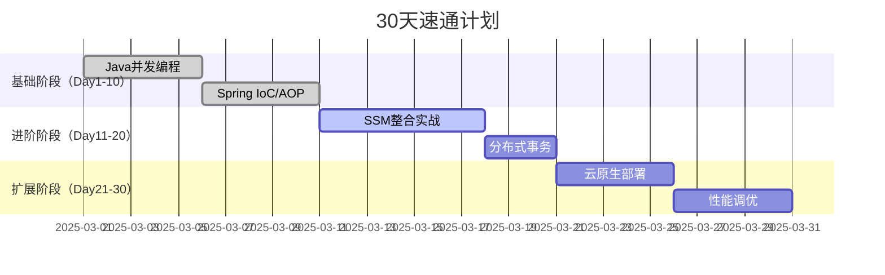

# 2025年SSM框架全栈技术路线

---

## 一、前置知识体系

### 1. Java核心基础（⭐⭐⭐必学）
| 技术领域     | 关键知识点                                                   | 学习等级 | 备注               |
| ------------ | ------------------------------------------------------------ | -------- | ------------------ |
| **语言特性** | Lambda表达式、Stream API、Pattern Matching（JDK21+）         | ⭐⭐⭐      | 必须手写复杂流操作 |
| **并发编程** | VirtualThread（Loom）、StampedLock、CompletableFuture组合式异步 | ⭐⭐⭐      | 替代传统Thread模型 |
| **JVM原理**  | G1/ZGC原理、堆外内存管理、JVM参数调优                        | ⭐⭐       | 掌握OOM排查方法    |

### 2. 数据库与网络（⭐⭐重点）
| 技术方向      | 必学内容                                                  | 过时技术（⚠️）        |
| ------------- | --------------------------------------------------------- | -------------------- |
| **MySQL 8.0** | 窗口函数、CTE表达式、列式索引、分库分表（ShardingSphere） | MyISAM引擎、存储过程 |
| **HTTP协议**  | HTTP/3特性、RESTful设计规范、JWT认证                      | Cookie/Session认证   |

---

## 二、SSM框架核心模块

### 1. Spring 6.x（⭐⭐⭐）
| 技术点     | 必学等级 | 2025重点特性                          | 替代方案（⚠️淘汰技术） |
| ---------- | -------- | ------------------------------------- | --------------------- |
| IoC容器    | ⭐⭐⭐      | 条件装配（@Conditional）、Java Config | XML配置               |
| AOP编程    | ⭐⭐⭐      | AspectJ注解、动态代理选择策略         | 原生动态代理API       |
| 事务管理   | ⭐⭐⭐      | @Transactional传播机制、分布式事务    | XML事务声明           |
| 响应式编程 | ⭐⭐       | WebFlux整合、RSocket协议支持          | 传统Servlet同步模型   |

### 2. Spring MVC 6.x（⭐⭐）
| 技术点      | 必学等级 | 2025重点特性                           | 替代方案（⚠️淘汰技术） |
| ----------- | -------- | -------------------------------------- | --------------------- |
| RESTful API | ⭐⭐⭐      | 参数校验（Jakarta Validation 3.0）     | JSP表单提交           |
| 异常处理    | ⭐⭐       | @ControllerAdvice全局异常捕获          | 传统web.xml配置       |
| 性能优化    | ⭐⭐       | 异步处理（DeferredResult）、HTTP/3支持 | Freemarker模板引擎    |

### 3. MyBatis 3.5+（⭐⭐⭐）
| 技术点   | 必学等级 | 2025重点特性                    | 替代方案（⚠️淘汰技术） |
| -------- | -------- | ------------------------------- | --------------------- |
| 动态SQL  | ⭐⭐⭐      | `<script>`标签、OGNL表达式      | 原生JDBC拼接SQL       |
| 缓存机制 | ⭐⭐       | 二级缓存+Redis集成              | 本地缓存（Ehcache）   |
| 插件扩展 | ⭐⭐       | 分页插件（PageHelper）、SQL监控 | Hibernate全功能ORM    |

---

## 三、整合与扩展技术栈

### 1. 整合核心要点
| 模块         | 2025最佳实践                         | 过时方案（⚠️） |
| ------------ | ------------------------------------ | ------------- |
| **数据源**   | HikariCP连接池、多数据源动态路由     | Druid连接池   |
| **事务管理** | JTA分布式事务（Atomikos）、Seata整合 | 本地单库事务  |
| **日志系统** | SLF4J+Logback、ELK日志收集           | Log4j 1.x     |

### 2. 扩展生态（⭐⭐必学）
| 技术栈              | 核心功能                               | 学习重点              |
| ------------------- | -------------------------------------- | --------------------- |
| **Spring Security** | OAuth2.1协议、JWT令牌鉴权              | 权限模型设计          |
| **Redis**           | Stream数据类型、Redisson分布式锁       | 缓存穿透/雪崩解决方案 |
| **Prometheus**      | Spring Actuator指标监控、Grafana可视化 | JVM性能分析           |

---

## 四、过时技术全景图（⚠️禁止投入时间）

| 分类       | 技术点        | 淘汰原因       | 替代方案             |
| ---------- | ------------- | -------------- | -------------------- |
| **框架层** | Struts2       | 安全漏洞频发   | Spring MVC           |
| **视图层** | JSP/JSTL      | 前后端分离趋势 | React/Vue3           |
| **ORM层**  | Hibernate HQL | 复杂SQL性能差  | MyBatis动态SQL       |
| **工具链** | Eclipse+Maven | 效率低下       | IDEA Ultimate+Gradle |

---

## 五、学习资源与路径

### 1. 高效学习路径
