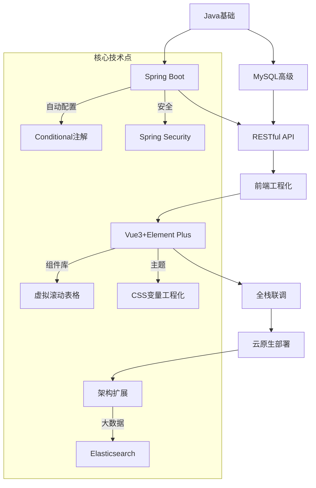

# Spring Boot + Vue 全栈开发技术路线（超详细版）

---

## 阶段1：Java与数据库深化（7天）🔥
### 1.1 Java并发编程（3天）
**核心技术**：

- ⭐ **线程池体系**：  
  - `ThreadPoolExecutor`七大核心参数（corePoolSize/maximumPoolSize等）  
  - 四种拒绝策略（AbortPolicy/CallerRunsPolicy等）  
- ⭐ **锁机制**：  
  - `ReentrantLock`与`synchronized`性能对比  
  - 读写锁`StampedLock`优化读多写少场景  
- ⭐ **异步编程**：  
  - `CompletableFuture`链式调用（`thenApplyAsync`/`thenCombine`）  
  - 并行流`parallelStream`陷阱与注意事项  

### 1.2 MySQL高级（4天）
**核心技术**：
- ⭐ **查询优化**：  
  - 索引失效场景分析（LIKE通配符开头的查询）  
  - 覆盖索引与索引下推（ICP）原理  
- ⭐ **事务隔离**：  
  - 通过案例演示不同隔离级别下的脏读/幻读现象  
  - 死锁检测与解决（`SHOW ENGINE INNODB STATUS`）  
- ⭐ **JSON操作**：  
  - `JSON_EXTRACT()`提取嵌套字段  
  - 生成列（Generated Columns）实现JSON字段索引  

**产出**：  
- 多线程文章批量导入工具（支持10万级数据并发写入）  
- 博客访问统计报表SQL（日活用户/热门分类排行）

---

## 阶段2：Spring Boot核心开发（14天）🚀
### 2.1 基础框架（5天）
**核心技术**：
- ⭐ **自动配置**：  
  - 条件注解原理（`@ConditionalOnClass`）  
  - 自定义Starter（META-INF/spring.factories配置）  
- ⭐ **Web开发**：  
  - 统一响应体封装（`Result<T>`泛型设计）  
  - 全局异常处理（`@ExceptionHandler`捕获Filter层异常）  

### 2.2 数据持久化（6天）
**核心技术**：
- ⭐ **MyBatis Plus**：  
  - 逻辑删除配置（`@TableLogic`）  
  - 多租户方案（Tenant Line插件）  
- ⭐ **JPA高级**：  
  - `Specification`动态查询构建  
  - `@EntityListeners`实现审计日志自动记录  

### 2.3 安全与监控（3天）
**核心技术**：
- ⭐ **Spring Security**：  
  - 方法级权限控制（`@PreAuthorize`）  
  - OAuth2.0社交登录集成（GitHub/微信）  
- ⭐ **Actuator监控**：  
  - 健康检查端点（/actuator/health）  
  - 自定义Metrics指标（文章发布次数统计）  

**产出**：  
- 带RBAC权限管理的博客后端系统  
- 可视化接口文档（Swagger3 + OpenAPI 3.0）

---

## 阶段3：现代Web前端开发（21天）🎨
### 3.1 HTML5/CSS3核心（7天）
**核心技术**：
- ⭐ **语义化结构**：  
  - 使用`<article>`包裹博客正文，`<time datetime>`标注发布时间  
  - 微数据标注（`itemscope`/`itemtype`提升SEO）  
- ⭐ **CSS布局系统**：  
  - Grid布局实现九宫格图片墙（`grid-template-areas`）  
  - Flex嵌套布局构建多级导航菜单  
- ⭐ **响应式设计**：  
  - 媒体查询适配移动端（隐藏侧边栏/调整字号）  
  - `srcset`属性实现图片分辨率自适应  

### 3.2 JavaScript工程化（7天）
**核心技术**：
- ⭐ **ES6+特性**：  
  - 可选链`?.`与空值合并`??`简化代码逻辑  
  - `Proxy`实现响应式数据监听（为Vue3原理铺垫）  
- ⭐ **模块化开发**：  
  - ES Module动态导入（`import()`实现路由懒加载）  
  - Webpack Tree Shaking优化（生产环境自动启用）  

### 3.3 Vue3+Element Plus整合（7天）
**核心技术**：
- ⭐ **组件库深度**：  
  - `el-table`虚拟滚动配置（`:row-height`/`threshold`参数调优）  
  - `el-form`递归表单生成（根据JSON Schema动态渲染）  
- ⭐ **主题工程化**：  
  - 使用CSS变量实现主题切换（配合`watchEffect`动态更新）  
  - SVG图标组件化（`<symbol>`+`<use>`复用方案）  

**产出**：  
- 响应式博客前台（支持PWA离线访问）  
- Element Plus管理后台（数据可视化仪表盘）

---

## 阶段4：全栈联调与安全（7天）🛡️
### 4.1 联调工程化（3天）
**核心技术**：
- ⭐ **Mock方案**：  
  - 使用MSW（Mock Service Worker）拦截API请求  
  - 根据OpenAPI规范生成模拟数据（swagger-typescript-api工具）  
- ⭐ **自动化测试**：  
  - Jest单元测试（Vue组件快照测试）  
  - Testcontainers集成测试（MySQL容器化测试环境）  

### 4.2 安全加固（4天）
**核心技术**：
- ⭐ **JWT全方案**：  
  - 双Token机制（Access Token 30分钟过期 + Refresh Token 7天）  
  - 黑名单管理（Redis存储已注销但未过期的Token）  
- ⭐ **防御体系**：  
  - CSP策略配置（禁止内联脚本/限制外部资源域名）  
  - SQL注入过滤（MyBatis `#{}`预处理 + 敏感词正则匹配）  

**产出**：  
- 通过OWASP Top 10安全测试的博客系统  
- 接口自动化测试覆盖率≥70%

---

## 阶段5：云原生部署（7天）☁️
### 5.1 基础设施（3天）
**核心技术**：
- ⭐ **阿里云实战**：  
  - ECS实例选购（突发性能型t6 vs 通用算力型g7）  
  - OSS跨域配置（CORS规则精细化控制）  
- ⭐ **容器化部署**：  
  - Docker多阶段构建（分离编译环境与生产镜像）  
  - Docker Compose编排MySQL+Redis+Spring Boot服务  

### 5.2 监控优化（4天）
**核心技术**：
- ⭐ **前端性能**：  
  - Lighthouse评分优化（启用HTTP2/资源预加载）  
  - Core Web Vitals达标（LCP≤2.5s/FID≤100ms）  
- ⭐ **后端监控**：  
  - Prometheus + Grafana监控JVM堆内存/QPS  
  - 日志告警（Elasticsearch异常检测机器学习作业）  

**产出**：  
- 通过HTTPS访问的生产环境博客（SEO综合评分≥90）  
- 实时监控仪表盘（CPU/内存/接口响应时间可视化）

---

## 阶段6：架构扩展（14天+）⚡
### 6.1 微服务化（7天）
**核心技术**：
- ⭐ **服务拆分**：  
  - 文章服务独立部署（Spring Cloud OpenFeign远程调用）  
  - 用户服务数据库分库（ShardingSphere分片策略）  
- ⭐ **网关层**：  
  - Spring Cloud Gateway限流（基于Redis的令牌桶算法）  
  - 统一鉴权中心（JWT验签集中化管理）  

### 6.2 大数据处理（7天）
**核心技术**：
- ⭐ **Elasticsearch**：  
  - 倒排索引原理剖析  
  - 搜索结果高亮与相关性排序（BM25算法）  
- ⭐ **实时计算**：  
  - Flink处理用户行为日志（阅读时长统计）  
  - WebSocket推送实时在线人数  

**产出**：  
- 支持百万级文章的分布式检索系统  
- 用户行为分析大屏（ECharts实时可视化）

---

## 学习路线图谱
